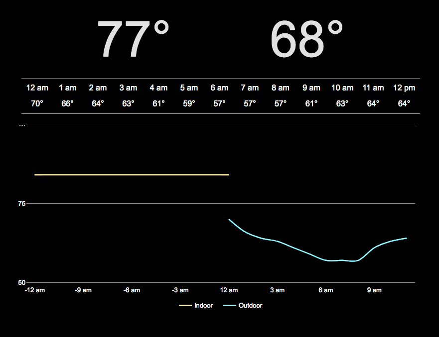

# Weather Station

## To Do

### Open
* Store historical indoor temperature in database
* Fix temperature graph displaying negative times
* Set up cron job on RPi to update indoor temperature every 5 minutes
* Design house icon
* Design outdoor weather icons (sun, clouds, rain, wind, etc.)
* Make graph interactive (zoom, scroll) like Google finance
* Mobile site?
* Consider updating site colors



### Complete

## Notes

[https://murmuring-caverns-91180.herokuapp.com/](https://murmuring-caverns-91180.herokuapp.com/)

### Set config var (for API keys)

```
# set the config var
heroku config:set GITHUB_USERNAME=joesmith

# view the config
heroku config

# unset a config var
heroku config:unset GITHUB_USERNAME
```