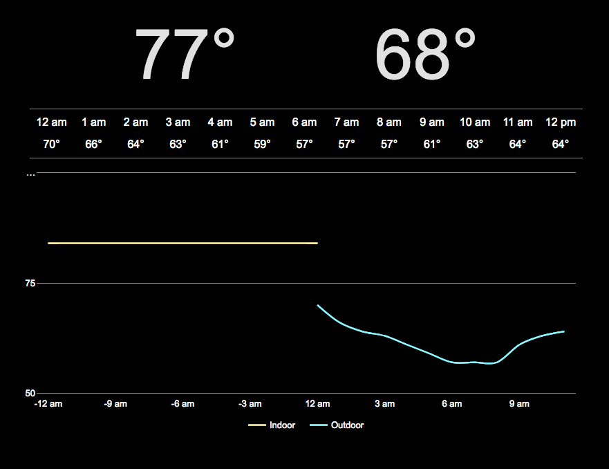

# To Do

## Open
* Design outdoor weather icons (sun, clouds, rain, wind, etc.)
* Update/improve security for temperature POST
* Store historical indoor/outdoor data in persistant database (Heroku?)
* Unix time instead of full date in API JSON data?
* API throttling to prevent malicious attacks (?). Anything built in to Flask?
* Design single API call to get historic indoor and forecast outdoor temperature
* Display weather icons
* Display weather warnings
* Make graph interactive (zoom, scroll) like Google finance
* Mobile site?
* Graph plot shouldn't move when switching between C and F
* Add option to set location
* Split app into client/server in separate repos?
* Unit tests!!!!!
* Consider updating site colors

## Complete
* Display weather conditions as text
* Store historical indoor temperature in database
* Set up cron job on RPi to update indoor temperature every 5 minutes
* Set URL as weather.gregpaton08.com
* Design house icon
* Fix temperature graph displaying negative times